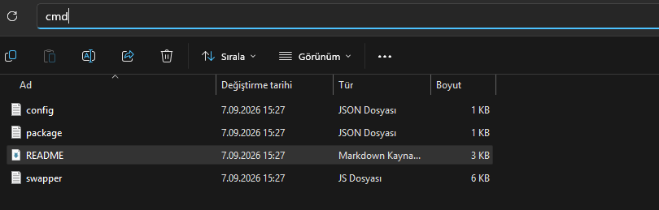

# dünyanın en iyi vdsiyle en fast kodu gelse bu swapperi failleyemez amınakoyim. 2fa açık sunuculardan bile vanity çekiyon bababaaaaaaa

## kurulum

```

klasorun ust kismina cmd yazip
npm install
komutunu calistir
```

bi kere yapıcan bunu tamamı sonra config.json açıyon 

```json
{
  "token": "hesabın user tokeni",
  "password": "hesabın şifresi",
  "serverID": "vanitynin çekileceği sunucu id, hesaba yönetici vermeyi unutma yoksa yarragi yersin",
  "vanityURL": "çalınacak url",
  "mfa": "",
  "claimCount": 5,
  "countdown": 1
}
```

## mfa olayı (önemli kısım burası aq)

iki yol var baba:

### 1. SUNUCUDA 2 FAKTÖRLÜ DOĞRULAMA KAPALIYSA

`mfa`yı BOŞ bırak, sadece şifreyi tokeni guild idyi doldur. kod kendisi ticket ister, şifreyi yollar, mfa tokenını alır, süresi dolmadan yeniler sen hiçbir sikime karışmıyon yanı doldur geç baba

### 2. URL'Sİ CALINACAK SUNUCUDA 2 FAKTÖRLÜ DOGRULAMA ZORUNLUYSA 

şifre yetmiyo çünkü discord senden totp kodu istiyo. o zaman tokenı elinle alacan:

1. herhangi bi tarayıcıdan discord.com/app yaz giriyon, swap atacağın hesaba giriyon tamamı
2. sunucu ayarlarından vanity değiştirme yerine geliyon (hesabında 2fa açık olcak bu arada)
3. f12 basıyon (opera kullanıyosan ctrl shift i aynı anda), network kısmına giriyon
4. vanity kutusuna galatasaray yaz tamamı tamama bas
5. sana totp kodu sorar — giricen onu, doğru gir
6. networkte `finish` gibi bişey belirir — ona tıkla, response kısmına gir
7. oradaki uzun base64 metnini TAMAMINI EKSİKSİZ kopyalıyosun baba bi harf eksik olursa çalışmaz
8. configde `"mfa": ""` olan yere yapıştırıyosun

dikkat: bu token 4-5 dakika yaşar kopyaladıktan sonra götünü siktirtmezssen direkt çalıştır.

## çalıştırma

```
actigin cmdde npm install yaptiktan sonra
node swapper.js
```

ekranda şöyle akar:

```
[H2] Baglanti kuruldu
[MFA] ticket ok
[MFA] token len=... host=canary.discord.com
[COUNTDOWN] 1...
[DELETE] 200
200 | {"code":"roblox"}
```

`200` gördün mü vanity senindir aslanım tak tak tak.

## claimCount countdown ne diye sorabılırsın soyleyeyim 

- **claimCount**: fire anında kaç PATCH atıyo. 5 = 5 mermi, race varsa şansın artar. elleme 5 kalsın ben oyle kullaniyorum
- **countdown**: mfa hazır olduktan sonra kaç saniye saysın 1 yeter 0 yaparsan anında ateşler

## ekstra not

- cf ban yersen kod kendisi host değiştirir (canary → discord → ptb), ellemeyin karışmayın
- `mfa` doluysa otomatik alma kapalıdır, onu kullanır sifirlamayi unutma!
- bunu kavrarsanız hızlı bi şekilde direk tak tak tak yapabılırsınız :)))
